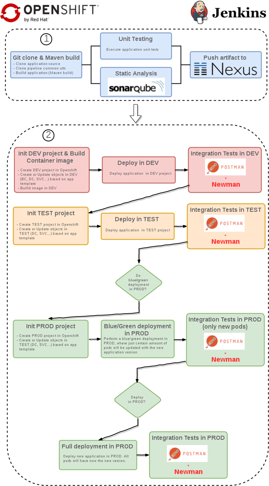
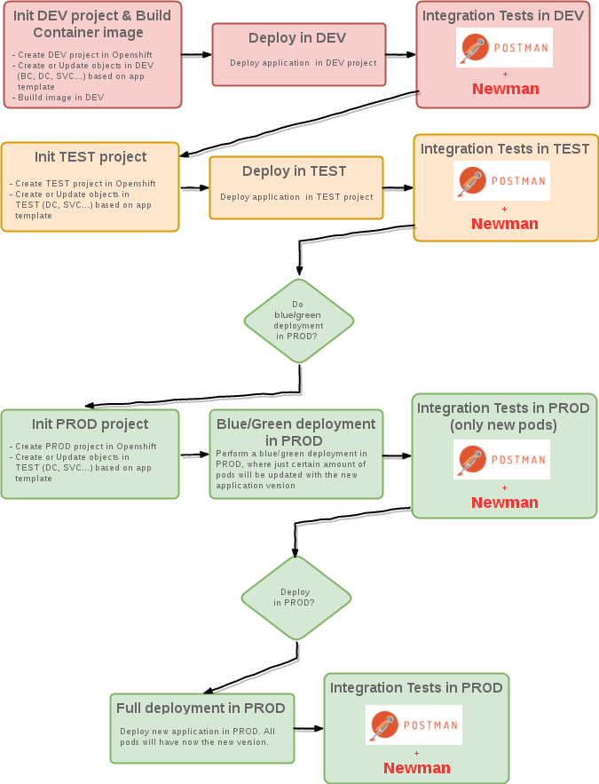

# CI/CD generic pipeline

## Introduction 

This repository describes and implements a generic Jenkins pipeline that could be used to perform a CI/CD workflow for your application on Openshift.
The term generic that I used before is limited by the following characteristics:
- The application is compiled and packaged by Maven
- The static analysis is done on Sonarqube
- The deliverable (artifact) is pushed in Nexus
- The application exposes a REST API, so integration testing could be automated (I have used Postman + Newman)

This means, this pipeline could be reused by any application that matches these characteristics. For the demonstration that I will describe next, I have used a simple application, that it is implemented with Spring Boot and exposes a very simple REST API. You can find it [here](https://github.com/dsanchor/demo-rest)

The pipeline is described by the following diagram. I will explain each stage in detail later in this document.


	
## Environment description

This demonstration requires Openshift version >= 3.6 (we will make use of environment variables for the pipeline BuildConfig). If you need to create a local cluster on your workstation, have a look at this [site](https://developers.redhat.com/products/cdk/overview/).

We also require a cluster admin user in Openshift (we need to provide some specific roles to certain service accounts).

As part of the infrastructure, we will create a:
- Jenkins server, in charge of running the pipeline.
- Nexus, where all deliverable artifacts will be pushed to. We will also use it as proxy and cache for third party libraries.
- Sonarqube, used to analize the application against a set of quality rules defined for an standard java application.


## Preparation

For create all the necessary infrastructure, we will need the Openshift client tool (oc). It could be downloaded [here](https://developers.redhat.com/products/openshift/download/). 

We will execute every step by executing CLI commands. 
	
### 1. Login to your Openshift cluster
```
oc login -u admin -p 123456 https://d-sancho.com:8443
```
### 2. Create a project called cicd. We will deploy all the CI/CD infrastructure in this project.
```
 oc new-project cicd 
```
Notice that I will explain all the steps that must be done in order to have the infrastructure ready. I could have prepared an Openshift template with all these applications defined and configured already, but I prefered to show you how to manually do it, so you were aware about every single step.

### 3. Create a Nexus server (ephemeral for this demo) and expose it externally 
```
oc new-app --docker-image=sonatype/nexus
oc expose svc/nexus
```
**Access to your Nexus server**
	
1) Get route
```
oc get route | grep nexus | awk '{print $2}'
nexus-cicd.apps.d-sancho.com
```		
2) Access main dashboard (http://nexus-cicd.apps.d-sancho.com/nexus) and login with admin/admin123
		

### 4. Do the same with Sonarqube
```
oc new-app --docker-image=openshiftdemos/sonarqube:6.5
oc expose svc/sonarqube
```
	
**Access to your Sonarqube server**

1) Get route
```
oc get route | grep sonarqube | awk '{print $2}'
sonarqube-cicd.apps.d-sancho.com
```	
2) Access main dashboard (http://sonarqube-cicd.apps.d-sancho.com) and login with admin/admin


### 5. Jenkins server

We are going to include some plugins that are not included by default in the current Jenkins image provided by Openshift (such as [jenkins-client-plugin](https://github.com/openshift/jenkins-client-plugin)). However, it is very likely that OCP 3.7 will provide this plugin by default (current version of OCP while writing this was 3.6).
	
**Create custom jenkins image** with some additional plugins. This image will be created on the openshift namespace, so it will be available from any namespace
```
oc new-build jenkins:2~https://github.com/dsanchor/jenkins.git --name=jenkins-custom -n openshift
```		
Once the new image is built, **deploy jenkins (ephemeral for this demo)**
```
oc new-app jenkins-ephemeral -p NAMESPACE=openshift -p=JENKINS_IMAGE_STREAM_TAG=jenkins-custom:latest -p MEMORY_LIMIT=2Gi -n cicd
oc expose svc/jenkins
```

And finally, **give self-provisioner cluster role to jenkins service account**. For this operation, you will require cluster admin privileges (Example, from any master node: oc login -u system:admin)
```
oc adm policy add-cluster-role-to-user self-provisioner system:serviceaccount:cicd:jenkins
```

## Pipeline description

I have divided the pipeline in two parts. First part (1) is all about CI (Continuous Integration), while the second part (2) is about CD (Continuous Delivery) on Openshift.

### 1. CI (Continuous Integration)


As shown in the previous diagram, the CI part of the pipeline is divided 3 main stages, although there is also a preparation phase. I will enumerate every action that is performed during this CI process:

- Preparation:
   - Cloning and loading some pipeline utils functions that will be used during the whole process
   - Initializing Maven command with a custom [settings.xml](https://github.com/dsanchor/demo-cicd/blob/master/maven/settings.xml). Notice that you will have to **configure this settings.xml with the right values for your environment**

- Maven package
   - Cloning application source code
   - Package application
   - Stash the application template. This means, saving the template, it will be used later and we will not have to download/clone it again

- Unit testing & Analysis
   - Run unit testing with Maven
   - Publish sonar report 

- Push Artifact to Nexus
   - Version will be extracted from [pom.xml](https://github.com/dsanchor/demo-rest/blob/master/pom.xml)
   - Artifact will be uploaded to a release repository defined in pom.xml (distribution management) and store in Nexus. 
     Notice that Nexus will reject uploading the same version twice. So it is important to **modify this version in the application pom.xml prior triggering this pipeline**. It is not the aim of this demo to define any strategy for version management or git branching, but a good and simple approach is "feature branching". In this case, you will create a "git branch" for every new feature (or hotfix) and you will merge it back to the master branch once it is finished. It is before merging when you could define a new version. Also, you have the possibility of using the well known maven release plugin to automate the version management and releases process. 

This CI process will run on a Maven slave in Openshift. To set it in the pipeline, notice "node ("maven") { .... }". 

### 2. CD (Continuous Delivery)



In this case, we will use a NodeJs slave for running the CD part. This is mainly because for running the tests we will use Postman+Newman and last one requires npm. Notice then that all the code related to CD is enclosed inside "node ("nodejs") { .... }"

The execution of the pipeline will be performed and affect 3 different environments (Openshift projects), which names are parameterized per project (as many other project specific parameters, but I will talk about this later). 

Main stages and actions performed during this CD process are:

- On DEV environment
   - Initialization and build
      - Create DEV project based on given parameter name (ex: development, team-a-development...). In this document, it will be always referred as DEV. If the project already exists, it should just add the  "edit" role to the jenkins ServiceAccount in order to give Jenkins the right privileges to trigger builds and deploys.
      - Create/Update all Openshift objects (ImageStream, DeploymentConfig, BuildConfig and so on) in DEV project as declared in the application template. For more details about which objects are going to be created, have a look at the [template](https://github.com/dsanchor/demo-rest/blob/master/openshift/templates/demo-rest-template.yml) I will use in this demo.
      - Build application image. It will get the application binaries from Nexus, create a new image and publish it in the internal registry
   - Deploy in DEV
   - Run integration tests in DEV
      - This application exposes a REST API that could be easily tested by tools such as Postman and Newman. I have created a common test collection with Postman that will be used for testing the application against all different environments (DEV, TEST, PROD). Newman will then use this collection plus the specific environment config file to run these tests from the pipeline. For more details, see the test collection and environment definitions in the [application repository](https://github.com/dsanchor/demo-rest/tree/master/openshift/tests). All these files have been created using the Postman tool and you could easily export/import them. 

   If all tests have passed successfully, the pipeline will move to next stage, which is deploying the application in the TEST environment.

- On TEST environment
   - Deploy in TEST
      - Create TEST project based on given parameter name (ex: test, team-a-test...). In this document, it will be always referred as TEST. If the project already exists, it should just add the  "edit" role to the jenkins ServiceAccount in order to give Jenkins the right privileges to trigger builds and deploys.
      - Promote image. That is, tag image that has been created in DEV to a know tag that is used in TEST
      - Create/Update all Openshift objects in TEST project as declared in the application template, but in this case, neither BuildConfig and ImageStream is created, since the image has been created in DEV.
      - Deploy application
   - Run integration tests in TEST

   Then, if all tests succeeded, there will be a manual aproval required to perform a Blue/Green deployment in PROD.

- On PROD environment
   - Blue/Green deployment in PROD
      - Create PROD project based on given parameter name (ex: production, team-a-production...). In this document, it will be always referred as PROD. If the project already exists, it should just add the  "edit"
      - Promote image. That is, tag image that has been created in DEV to a know tag that is used in PROD
      - Create/Update all Openshift objects in PROD project as declared in the application template, but in this case, neither BuildConfig and ImageStream is created, since the image has been created in DEV.
      - Blue/Green deployment in PROD. Just some percentage of the existing pods will be updated with new application version.
   - Run integration tests in PROD, but only new pods will be the target of these tests
   - If all tests succeeded, there will be a manual aproval required to perform a full deployment in PROD.
   - Full deployment in PROD. All pods will now be updated to new application version


## Pipeline creation

As we have seen through this document, I have defined the pipeline as "generic". This means that it could be used by any application that has similar characteristics as explained in the introduction. It is also remarkable that having the pipeline as code and centralized will facilitate any update on it and the propagation of these changes to all the configured pipelines. 

Then, to make it specific to the given application, there are some parameters that have to be defined, such as the git url of the source code for the application, the names for the DEV/TEST/PROD projects, nexus and sonar urls.. and so on. As an example, have a look at the one I have used for this [demo application](https://raw.githubusercontent.com/dsanchor/demo-rest/master/openshift/templates/bc-pipeline.yml). It is defined as a BuildConfig, where the strategy is set to jenkinsPipelineStrategy.

In order to create the BuildConfig object in openshift and trigger the pipeline, execute the following commands:

```
oc create -f https://raw.githubusercontent.com/dsanchor/demo-rest/master/openshift/templates/bc-pipeline.yml -n cicd
oc start-build demo-rest-pipeline -n cicd
```

There will be some manual approval steps to complete the whole CI/CD process. 

TODO next steps (such as modifying the code and version of the app and trigger the pipeline again)
Notes:
	Change pom.xml to avoid nexus duplications
